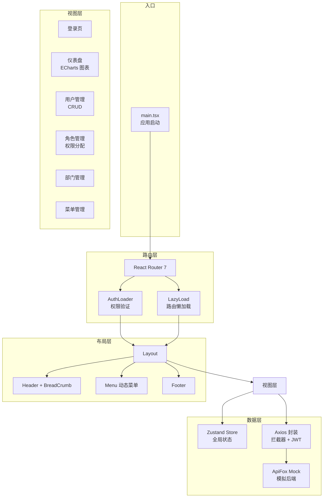

# React Admin System

[](https://react.dev/)
[](https://www.typescriptlang.org/)
[](https://vitejs.dev/)
[](https://ant.design/)
[](https://zustand.docs.pmnd.rs/)
[](https://reactrouter.com/)
[](https://echarts.apache.org/)


企业级后台管理系统前端方案，基于 React 18 + TypeScript + Vite 6 构建，集成 Ant Design 5、Zustand 状态管理、React Router 7 动态路由、ECharts 数据可视化，具备完整的 RBAC 权限体系和 Mock 数据方案。

## 架构总览



## 技术选型

| 维度 | 选型 | 理由 |
|------|------|------|
| 框架 | React 18 | 生态成熟，Hooks 模式开发效率高 |
| 语言 | TypeScript 5.6 | 类型安全，减少运行时错误 |
| 构建 | Vite 6 | 冷启动 < 1s，HMR 毫秒级，碾压 CRA |
| UI 库 | Ant Design 5 | 企业级组件库，表格/表单/弹窗开箱即用 |
| 状态管理 | Zustand 5 | 比 Redux 轻量 10 倍，无 Provider 包裹，TS 友好 |
| 路由 | React Router 7 | 新版 loader 机制支持数据预取，路由级代码分割 |
| 图表 | ECharts 5 | 百度开源，社区最活跃的 Canvas 图表库 |
| HTTP | Axios | 拦截器链式处理，比 fetch 更优雅的错误处理 |
| Hooks | ahooks | 阿里开源，补齐 React 缺少的常用 Hook |
| Mock | Mock.js + ApiFox | 拦截 Ajax 生成随机数据，前后端并行开发 |

### 为什么 Zustand 而不是 Redux？

Redux 需要 Provider 包裹、定义 action/reducer、处理不可变更新，一个简单状态要写 4 个文件。Zustand 一个 `create()` 搞定全部，没有模板代码，天然支持 TypeScript 推导。对于一个中小型后台，Redux 是过度设计。

### 为什么 Vite 而不是 CRA？

CRA（Create React App）基于 Webpack，冷启动 30s+，HMR 3s+。Vite 利用浏览器原生 ESM，冷启动 < 1s，HMR < 100ms。CRA 已停止维护，Vite 是 React 官方推荐的构建工具。

## 项目结构

```
src/
├── main.tsx                # 应用入口，挂载 RouterProvider
├── App.tsx                 # 根组件
├── router/
│   ├── index.tsx           # 路由配置（动态路由表）
│   ├── AuthLoader.ts       # 路由守卫：登录 + 权限验证
│   └── LazyLoad.tsx        # Suspense 懒加载包裹
├── layout/
│   ├── index.tsx           # 布局容器（Sider + Header + Content）
│   ├── header/             # 顶栏（面包屑 + 用户头像）
│   ├── menu/               # 侧边菜单（递归渲染）
│   └── footer/             # 底部
├── views/
│   ├── login/              # 登录页
│   ├── welcome/            # 欢迎页
│   ├── dashboard/          # 仪表盘（ECharts 图表）
│   ├── user/               # 用户管理（表格 + 搜索 + 弹窗 CRUD）
│   ├── role/               # 角色管理（权限树设置）
│   ├── dept/               # 部门管理（树形表格）
│   └── menu/               # 菜单管理
├── store/index.ts          # Zustand 全局状态（用户信息、侧边栏、主题）
├── utils/
│   ├── request.ts          # Axios 封装（JWT、响应拦截、错误处理）
│   ├── storage.ts          # localStorage 工具
│   └── index.ts            # 通用工具函数
├── api/
│   ├── index.ts            # API 接口定义（登录、用户、角色等）
│   └── roleApi.ts          # 角色相关 API
├── types/api.ts            # TypeScript 类型定义
├── hooks/                  # 自定义 Hooks（图表、历史记录、本地存储）
└── components/             # 通用组件（Card、SearchForm、AuthButton）
```

## 核心功能

### RBAC 权限体系

```
用户登录 → AuthLoader 拉取权限 → 动态渲染菜单 + 路由守卫 + 按钮级控制
```

- **路由级权限**：AuthLoader 在进入页面前校验 token 和菜单权限，未授权跳转 403
- **菜单级权限**：根据后端返回的 `menuList` 递归渲染侧边栏，不同角色看到不同菜单
- **按钮级权限**：`AuthButton` 组件读取 `buttonList`（如 `user@delete`），无权限时按钮不显示

### 动态路由 + 懒加载

每页独立 chunk，首屏只加载当前路由代码：

```
dist/
├── assets/
│   ├── index.html          (0.5 KB)
│   ├── react-vendor.js     (152 KB)  ← React + ReactDOM + Router
│   ├── antd-vendor.js      (680 KB)  ← Ant Design
│   ├── echarts-vendor.js   (996 KB)  ← ECharts（仅 Dashboard 加载）
│   ├── dashboard.js        (18 KB)   ← 仪表盘页
│   ├── user.js             (12 KB)   ← 用户管理页
│   └── ...
```

通过 `vite.config.ts` 的 `manualChunks` 控制分包策略，保证第三方库走浏览器缓存，业务代码按需加载。

### JWT 认证流程

1. 登录成功 → 后端返回 token + userInfo
2. token 存入 `localStorage`，userInfo 写入 Zustand Store
3. 所有请求通过 Axios 拦截器自动带 `Authorization: Bearer <token>`
4. 响应拦截器检测 `code === 40001` 自动跳转登录页

### ECharts 仪表盘

展示核心业务数据可视化（折线图、柱状图、饼图），ECharts 单独分包，仅 Dashboard 页加载，不影响其他页面首屏速度。

## 快速开始

```bash
# 安装依赖
npm install

# 启动开发服务器
npm run dev
# 访问 http://localhost:5173

# 构建生产版本
npm run build

# 预览构建结果
npm run preview
```

